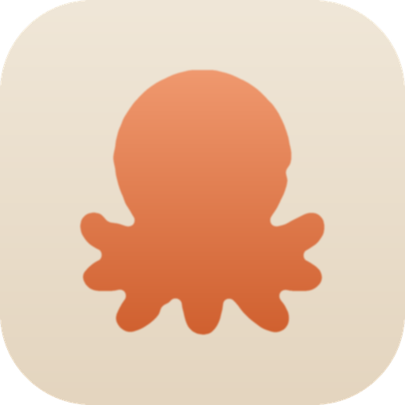

  

# Claude Profiles

Run several separate **Claude Desktop logins** side by side on one machine — like
browser profiles, but for Claude. Add a profile, give it a name (and an icon),
and launch it. Your work and personal logins stay signed in at the same time.

Run **multiple Claude Desktop accounts** side by side — work, personal, and
client logins open at the same time — on **macOS, Windows, and Linux**. It's a
free, open-source **multi-account manager and profile switcher** for the Claude
desktop app: no more signing out and back in to change accounts.

Claude Profiles works on your **already-installed** Claude — it never bundles or
redistributes Anthropic's app, and it never touches your conversations.

---

## Install

You don't need Node, a terminal, or any developer setup to use Claude Profiles.
Just download the installer for your OS.

> **Requirement:** [Claude Desktop](https://claude.ai/download) must already be
> installed. Claude Profiles launches *your* Claude; it doesn't ship its own.

> **Heads-up: the app is unsigned, so your OS warns you on first launch. This is normal and the app is safe.**
> Claude Profiles is open-source and not signed or notarized (it has no paid Apple or Microsoft certificate), so:
>
> - **macOS** says it "could not verify" the app. On newer macOS the dialog may only show **Done** and **Move to Bin**. Do **not** click Move to Bin. Click **Done**, then open **System Settings → Privacy & Security**, scroll down, and click **Open Anyway** (confirm with Touch ID).
> - **Windows** may show "Windows protected your PC"; click **More info**, then **Run anyway**.
>
> You only do this once per install. The per-OS steps below cover it in detail.

### macOS

1. Go to the [**Releases**](https://github.com/shahrukhkhan007/claude-profiles/releases/latest) page and download the
   macOS **`.dmg`**. It's a **universal** build, so the same file runs on both
   **Apple Silicon** (M1/M2/M3/M4) and **Intel** Macs. Not sure which you have?
   Apple menu > **About This Mac**. (If a release ever lists separate files,
   `...-arm64.dmg` is Apple Silicon and `...-x64.dmg` is Intel.)
2. Open the `.dmg` and drag **Claude Profiles** into **Applications**.
3. **First launch (unsigned app).** macOS says it "could not verify" Claude
   Profiles, and on macOS Sequoia (15) and later the dialog may only show **Done**
   and **Move to Bin**. This is expected for an un-notarized app, so do **not**
   Move it to the Bin. Click **Done**, then open it using either option:

   - **Option A, from System Settings (no terminal):** open **System Settings >
     Privacy & Security**, scroll down, click **Open Anyway**, then confirm with
     Touch ID. (On older macOS you can instead right-click the app, choose
     **Open**, then **Open** again.)
   - **Option B, from Terminal (one command):** run
     `xattr -dr com.apple.quarantine "/Applications/Claude Profiles.app"`, then
     open the app.

   You only do this once.
4. When you launch a **Custom** profile the first time, macOS may ask to use
   "Claude Safe Storage" from your keychain, click **Always Allow**. It's your
   own Claude data on your own machine.

### Windows

1. Download the **`.exe`** installer from the [latest release](https://github.com/shahrukhkhan007/claude-profiles/releases/latest) and run it.
2. SmartScreen may warn about an unknown publisher (the build isn't signed yet) —
   click **More info → Run anyway**.

### Linux

Download the **`.AppImage`** or **`.deb`** from the
[latest release](https://github.com/shahrukhkhan007/claude-profiles/releases/latest):

- **AppImage** — make it executable (`chmod +x <file>`) and run it.
- **.deb** — install it with `sudo dpkg -i <file>`.

> **No prebuilt release yet?** Until installers are published on the Releases
> page, you can build your own in one command — see
> [Build the installer yourself](#build-the-installer-yourself) below.

---

## Using it

The app has two tabs — the tab you're in decides how a profile is created, so
there are no confusing toggles:

- **Quick Launch** — the lightweight way. Each profile is the normal Claude app
  pointed at its own data folder. Instant, and it auto-updates with Claude. On
  macOS these share the same Dock icon.
- **Custom** — each profile gets its **own name and icon** in the Dock. On macOS
  this is a renamed copy of Claude so the icon can differ; on Windows and Linux
  it's a shortcut, so custom icons and auto-update both work with no trade-off.

Add a profile with **+ Add**, pick a colour or an image, and **Launch**. Each
profile keeps a completely separate login, history, and settings.

## How it works

Each profile is just Claude launched with its own `--user-data-dir`, so it keeps
a separate login, history, and settings. The app records your profiles in
`~/.claude-profiles/profiles.json` and reads live status (running / stopped)
from the OS. It never touches your conversations or your main Claude data.

## A note on safety

Claude Profiles operates only on **your already-installed Claude** — it never
bundles or redistributes Anthropic's app. It reads your local files and creates
separate data folders; it never modifies your conversations.

## Contributing

Claude Profiles is open source (MIT). If you'd like to build it from source,
run it in development, or contribute changes, see **[CONTRIBUTING.md](CONTRIBUTING.md)**.

## License

[MIT](LICENSE)
