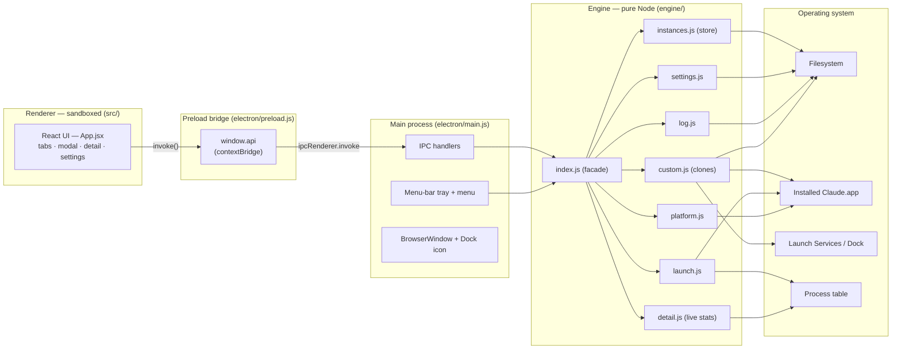
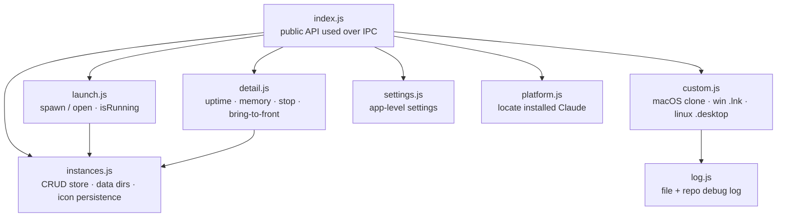
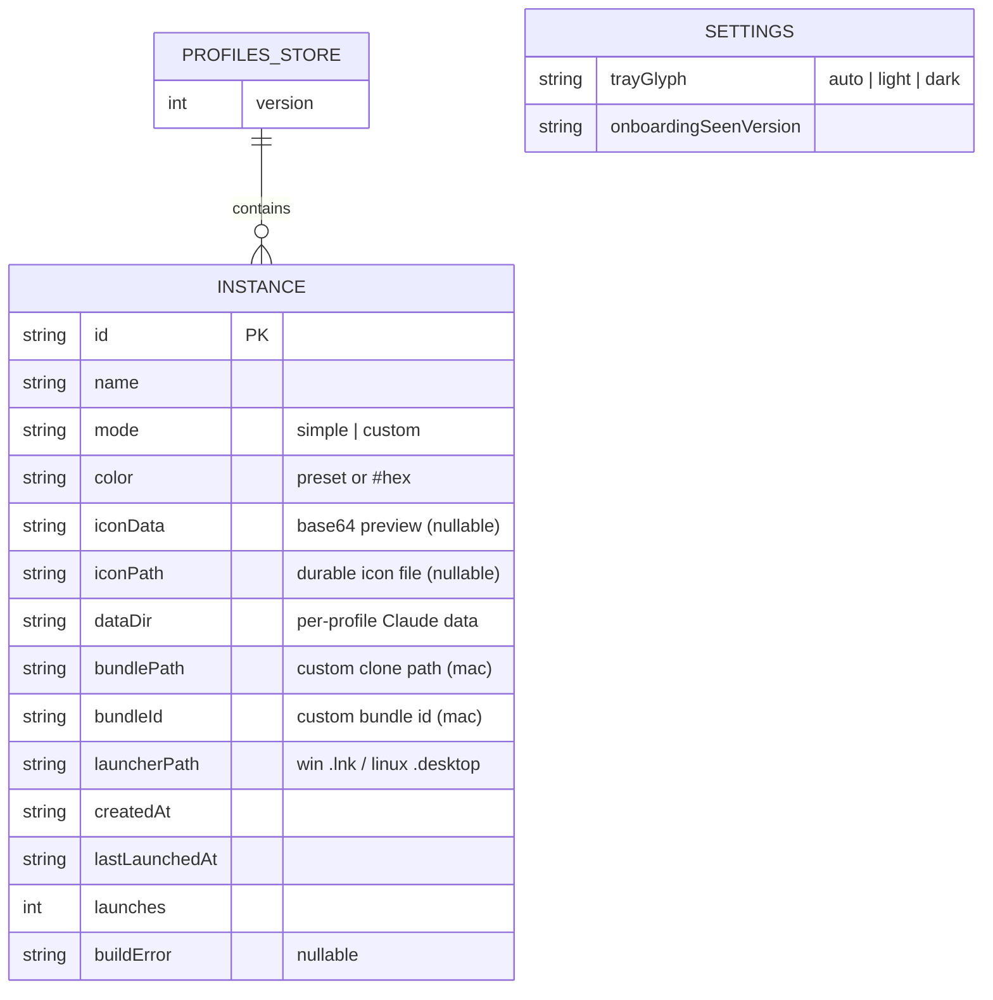
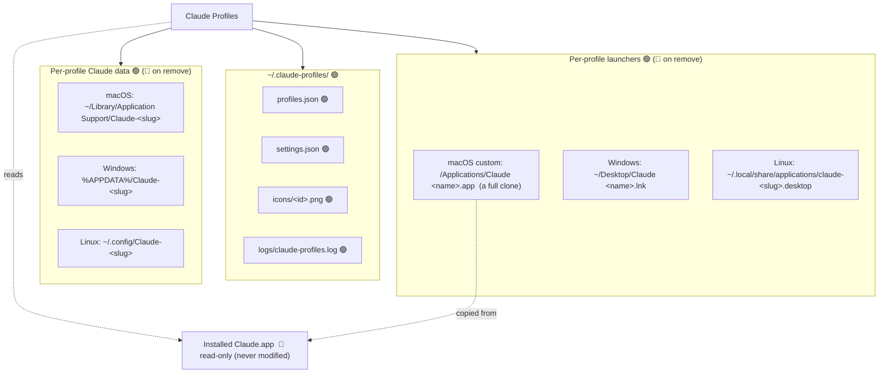
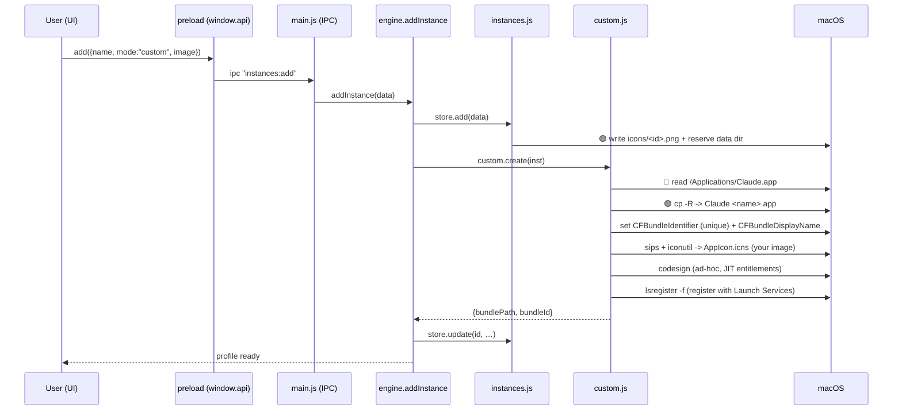
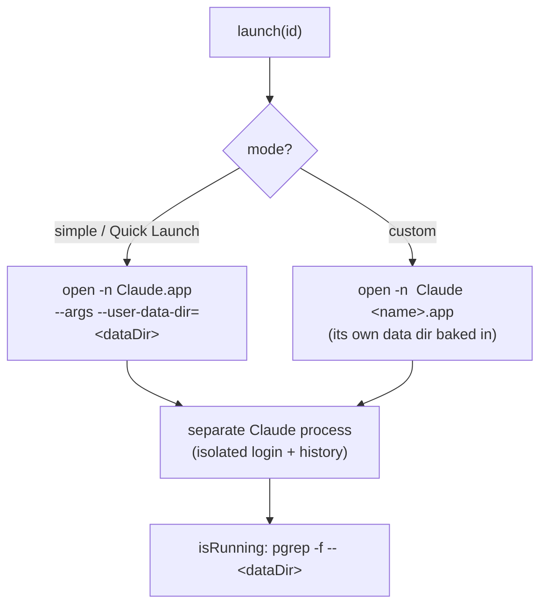
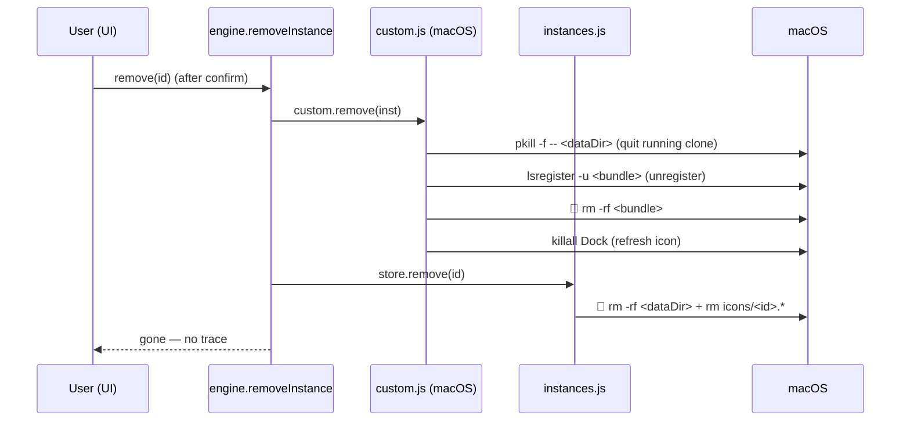

# Architecture

How Claude Profiles is put together, and exactly what it does to your machine.
Every diagram below is Mermaid and renders on GitHub.

**Legend** — throughout: 🟢 **created/written** by the app · 🔵 **read** by the
app · 🔴 **removed** on delete. The app never modifies your installed Claude.

---

## 1. High-level architecture

Three layers: a sandboxed React UI, the Electron main process that owns the
windows/tray and brokers IPC, and a **pure-Node engine** (no Electron or React
imports) that does the real work against the OS.

**Why the split?** The engine has zero Electron/React dependencies, so it's
unit-testable in plain Node and could power a CLI later. The renderer can only
reach the OS through the narrow `window.api` surface the preload exposes.

---

## 2. Engine modules

---

## 3. Data model (the "schema")

State is small JSON files, not a database. Two files under `~/.claude-profiles/`.

- `profiles.json` = `{ version, instances: Instance[] }`
- `settings.json` = the `SETTINGS` object (read by the tray in the main process)

---

## 4. On-disk footprint — what it picks up and what it drops

| Path | When | Lifecycle |
|---|---|---|
| `~/.claude-profiles/profiles.json` | first run | app-managed |
| `~/.claude-profiles/settings.json` | on settings change | app-managed |
| `~/.claude-profiles/icons/<id>.<ext>` | when a profile has an image | removed on delete |
| `~/.claude-profiles/logs/…` | always | app-managed |
| `…/Claude-<slug>` (data dir) | on first launch of a profile | **removed on delete** |
| `/Applications/Claude <name>.app` | custom profile create (macOS) | **removed on delete** |
| `~/Desktop/Claude <name>.lnk` | custom profile (Windows) | removed on delete |
| `~/.local/share/applications/claude-<slug>.desktop` | custom profile (Linux) | removed on delete |
| Installed `Claude.app` | read only | never changed |

---

## 5. Creating a custom profile (macOS clone)

The interesting part: giving a profile its own Dock identity means handing macOS
a *distinct app bundle*, because macOS keys "is this a separate app?" off the
bundle and its identifier, and draws the Dock icon from the bundle's `.icns`.

> `CFBundleName` is deliberately left unchanged — Electron derives its helper
> app path from it (`<CFBundleName> Helper.app`), so renaming it makes the clone
> crash at launch. The Dock label uses `CFBundleDisplayName` instead.

Windows and Linux don't clone: they write a shortcut / `.desktop` entry that
points at the installed Claude with `--user-data-dir=<dataDir>` and a custom icon.

---

## 6. Launching a profile

Isolation comes entirely from a distinct `--user-data-dir`: separate login,
history, and settings per profile. "Running" is detected by matching that data
dir in the process table.

---

## 7. Removing a profile (full teardown)

A clone you manually *pinned* to the Dock leaves a user-level pin macOS keeps
even after the app is gone — that one is removed by hand.

---

## 8. Boundaries at a glance

- **Renderer** can't touch the OS directly — only via `window.api`.
- **Main** owns windows, the tray, and IPC; it never does filesystem work itself.
- **Engine** is the only layer that touches the disk, Claude.app, Launch
  Services, and processes — and it's pure Node, so it's fully unit-tested.
- The installed **Claude.app is read-only** to this app; profiles are built
  *around* it, never by modifying it.
